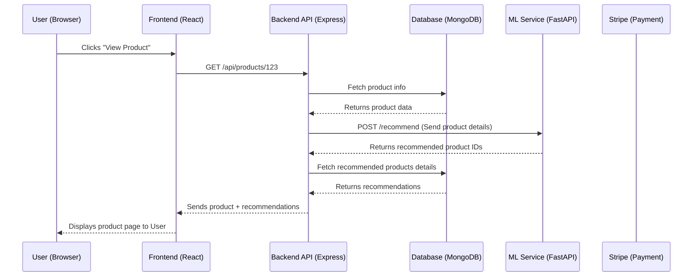

# 00: Project Overview - TechFreak

Welcome to the **TechFreak** project! If you're reading this, you are about to learn how a modern, full-stack web application is built from the ground up. 

Don't worry if you feel overwhelmed right now. We are going to explain everything as if you've never built a website before. By the end of this guide, you won't just know *what* code we wrote, you'll know *why* we wrote it, and how to talk about it like a senior engineer in an interview.

---

## 🧐 What is TechFreak?

**TechFreak** is a fully functional e-commerce platform dedicated to selling tech gadgets (laptops, phones, accessories, etc.). 

Think of it like a miniature version of Amazon or Best Buy, but specifically for tech enthusiasts. Users can:
1. Create an account and log in securely.
2. Browse products, search for specific gadgets, and see personalized recommendations.
3. Add items to a shopping cart.
4. Securely pay for their items using a credit card.
5. Receive an email receipt for their purchase.

### The Problem it Solves
Building a simple website is easy. Building a system that can securely handle user passwords, process real money, remember what's in a shopping cart, and recommend products based on machine learning? That's hard. 

TechFreak solves the problem of combining multiple different technologies into one cohesive, secure, and fast application. It demonstrates how modern web applications are split into multiple "services" that talk to each other.

---

## 🏗️ High-Level Architecture (The 30,000 Foot View)

TechFreak is not just one big chunk of code. It is split into **three separate parts** (often called a 3-tier or microservice architecture). Splitting it up makes the code easier to manage, test, and upgrade.

Here are the three parts:

1. **The Frontend (The Face):** What the user sees and interacts with in their web browser (buttons, text, images).
2. **The Backend API (The Brain):** The hidden server that processes business logic (checking passwords, saving orders to the database, talking to the payment processor).
3. **The ML Service (The Recommender):** A specialized mini-server (microservice) that only does one thing: figures out which products a user might like based on complex math.

### How They Communicate

These three parts live on different servers on the internet, but they talk to each other constantly.
- The **Frontend** sends an HTTP request to the **Backend** (e.g., "Hey Backend, the user clicked 'Add to Cart', please save this!").
- The **Backend** receives the request, updates the Database, and sends a response back (e.g., "Got it! Cart updated.").
- When a user views a product, the **Backend** silently asks the **ML Service**: "This user is looking at a Macbook Pro. What else should I show them?" The **ML Service** crunches the numbers and replies with a list of related products, which the Backend then sends to the Frontend.

### Data Flow Diagram

Here is a visual representation of how data moves through TechFreak:



---

## 🛠️ The Tech Stack (What we used and WHY)

When engineers build an app, they have to choose their tools (the "stack"). Here is what we chose for TechFreak and why.

### 1. Frontend (React)
- **What it is:** React is a JavaScript library built by Facebook for building User Interfaces (UI).
- **Why we chose it:** Traditional websites reload the entire page every time you click a link. React allows us to build "Single Page Applications" (SPAs) where only the necessary parts of the screen update. This makes the app feel extremely fast, like a mobile app.
- **Alternatives we didn't use:** Angular, Vue.js, or plain HTML/CSS/JS.

**Other Frontend Tools:**
- **Vite:** A build tool that bundles our React code super fast. (Alternative: Create React App / Webpack).
- **SWR:** A tool for fetching data from the backend. It automatically caches (remembers) data so we don't have to ask the backend twice for the same thing. (Alternative: React Query, Redux).
- **React Router v6:** Handles moving between different pages (like `/cart` or `/login`) without reloading the browser.
- **Stripe:** The industry standard for handling credit cards securely. We never see the user's raw credit card number.
- **Formik & Yup:** Tools for building forms (like login or checkout) and validating that the user typed things correctly (like ensuring an email has an '@' symbol).
- **Sass:** A superpower for CSS that makes styling our website cleaner and easier to organize.

### 2. Backend (Express.js + Node.js)
- **What it is:** Node.js lets us run JavaScript on a server (instead of just in a browser). Express is a framework that makes building APIs with Node.js very easy.
- **Why we chose it:** Since our frontend is built with JavaScript (React), using JavaScript on the backend means we only have to know one programming language!
- **Alternatives we didn't use:** Django (Python), Spring Boot (Java), Ruby on Rails.

**Other Backend Tools:**
- **MongoDB / Mongoose:** MongoDB is our database. It stores data as "Documents" (like JSON objects) instead of rigid tables. Mongoose is the translator that lets our Node.js code talk to MongoDB easily. (Alternative: PostgreSQL, MySQL).
- **JWT (JSON Web Tokens) + httpOnly Cookies:** This is how we handle logging in securely. (Alternative: Session-based auth).
- **bcryptjs:** Hashes (scrambles) passwords before saving them to the database. We NEVER save raw passwords.
- **Nodemailer:** Sends email receipts to users after they buy something.
- **Puppeteer:** A tool that can control a hidden web browser. We use it for web scraping (gathering data from other sites).
- **Helmet / XSS / Rate Limiting:** Security guards. They protect our server from hackers trying to inject malicious code or crash our server with too many requests.

### 3. Machine Learning Service (FastAPI + Python)
- **What it is:** A tiny, completely separate server built with Python whose only job is to recommend products.
- **Why we chose it:** Python is the king of Machine Learning. It has the best tools for math and data. We couldn't easily do this in our Node.js backend.
- **Alternatives we didn't use:** Flask, Django.

**Other ML Tools:**
- **FastAPI:** A modern, incredibly fast Python framework for building APIs.
- **Pandas:** A tool for manipulating huge tables of data.
- **Scikit-Learn (TF-IDF + Cosine Similarity):** The math engines. They analyze the text descriptions of products to figure out which ones are mathematically similar (e.g., matching a "gaming mouse" with a "mechanical keyboard").

---

## 📁 Folder Structure Overview

If you look at the TechFreak code, you'll see a structure similar to this. Understanding where files live is half the battle.

```text
TechFreak/
│
├── frontend/                 # Everything the user sees (React)
│   ├── src/
│   │   ├── components/       # Reusable UI pieces (Buttons, Navbar)
│   │   ├── pages/            # Full pages (Home, Cart, Login)
│   │   ├── hooks/            # Custom React logic
│   │   └── styles/           # Sass files for making things look pretty
│   └── package.json          # List of frontend tools we installed
│
├── backend/                  # The brain (Express API)
│   ├── controllers/          # The logic (e.g., "what happens when user logs in")
│   ├── models/               # Database structure (e.g., "what does a Product look like")
│   ├── routes/               # The URLs the frontend can call (e.g., /api/users)
│   ├── middleware/           # Security checks before logic runs
│   └── server.js             # The main file that starts the backend
│
└── ml_service/               # The recommender (Python)
    ├── main.py               # The FastAPI server
    ├── recommender.py        # The actual Scikit-Learn math logic
    └── requirements.txt      # List of Python tools we installed
```

---

## 🎤 Interview Prep: How to pitch this project

When an interviewer asks, "Tell me about a project you've worked on," you need to be able to explain TechFreak clearly and confidently. Here are three versions of your pitch depending on how much time you have.

### The 30-Second Elevator Pitch (High Level)
> "I built TechFreak, a full-stack e-commerce platform for tech products. The frontend is built with React and Vite for a fast, single-page experience. The backend is an Express.js API connected to a MongoDB database, handling secure JWT authentication and Stripe payments. I also built a separate Python microservice using FastAPI and Scikit-Learn to provide real-time, content-based product recommendations. The entire system is deployed on Vercel."

### The 1-Minute Pitch (Adding Context & Why)
> "I recently developed TechFreak, a modern 3-tier e-commerce application. 
> 
> For the user interface, I chose React with SWR for efficient data caching. I wanted the checkout process to be completely secure, so I integrated Stripe for payment processing and Formik for robust form validation. 
> 
> The core backend is an Express/Node.js API using an MVC architecture. I prioritized security by implementing HTTP-only cookies for JWT authentication, bcrypt for password hashing, and Helmet for HTTP header protection. 
> 
> The most interesting challenge was building the recommendation engine. Instead of bloating my Node server, I extracted that logic into a separate Python FastAPI microservice that uses Pandas and Cosine Similarity to analyze product metadata and return recommendations to the main backend."

### The 3-Minute Pitch (The Deep Dive - Use if they ask for details)
> *(Start with the 1-Minute pitch, then add...)*
> 
> "One of the key architectural decisions I made was decoupling the machine learning logic from the main API. Node.js is great for handling lots of quick, asynchronous web requests, but it's terrible at heavy mathematical computations—it blocks the main thread. 
> 
> By moving the recommendation engine to a stateless Python microservice via FastAPI, I achieved two things: First, I could utilize powerful Python libraries like Scikit-Learn to perform TF-IDF vectorization on product descriptions. Second, I ensured my main Express server wouldn't freeze up for other users while calculating recommendations.
> 
> Another focus area was data flow and state management on the frontend. Instead of using a heavy global state manager like Redux, I leveraged SWR. When a user adds an item to their cart, SWR mutates the local cache instantly for a snappy UI, while syncing with the backend in the background. 
> 
> Finally, security was a top priority. I completely avoided storing JWTs in `localStorage` to prevent Cross-Site Scripting (XSS) attacks. Instead, the Express server sends the JWT back in a secure, HTTP-only cookie, and I use rate-limiting to prevent brute-force attacks on the login endpoints."

---

## 🧠 Common Interview Questions (And how to answer them)

**Q: Why did you choose MongoDB instead of a SQL database like PostgreSQL?**
> **Model Answer:** "For an e-commerce platform with diverse tech products, MongoDB's flexible document model was a great fit. A laptop might have different specifications (like RAM and CPU) compared to a phone case. Instead of creating complex SQL table joins to handle different product attributes, MongoDB allowed me to store all varying attributes natively in a single document. However, if the platform grew to require strict, complex financial transactions where ACID compliance across multiple tables was critical, I would strongly consider migrating to PostgreSQL."

**Q: How do your frontend and backend handle authentication?**
> **Model Answer:** "When a user logs in, the Express backend verifies their hashed password using bcrypt. If successful, it generates a JWT. But importantly, I don't send the JWT back in the JSON response to be stored in the browser's local storage—that's vulnerable to XSS attacks. Instead, the backend attaches the JWT to an `httpOnly` cookie. The browser automatically includes this cookie in future requests to my API, but JavaScript running on the page can't read it, keeping it secure."

**Q: Tell me about a time you ran into a bug on this project and how you fixed it.**
> *(Note for you: You will need to fill this in with a real experience as you build the project, but here is a great template!)*
> **Model Answer:** "Initially, I noticed my React app was making too many requests to the backend API whenever the user navigated between pages, which was slowing things down. I realized the components were remounting and fetching data from scratch every time. I solved this by implementing SWR (Stale-While-Revalidate). It caches the API responses locally. So, when a user goes back to a product page they've already seen, SWR instantly shows the cached data, and then silently checks the backend in the background to see if anything changed. It drastically reduced server load and made the app feel instant."

---
*Ready to dive deeper? Proceed to the next document where we break down the Frontend in detail!*
