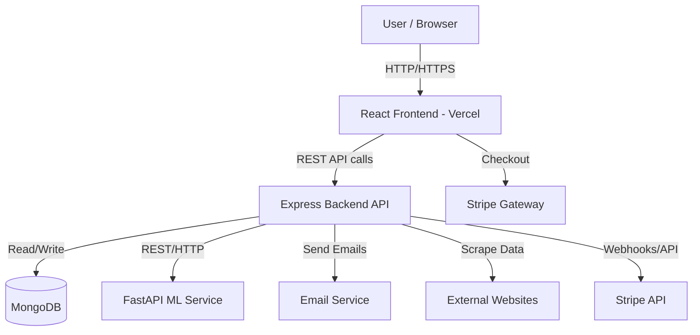
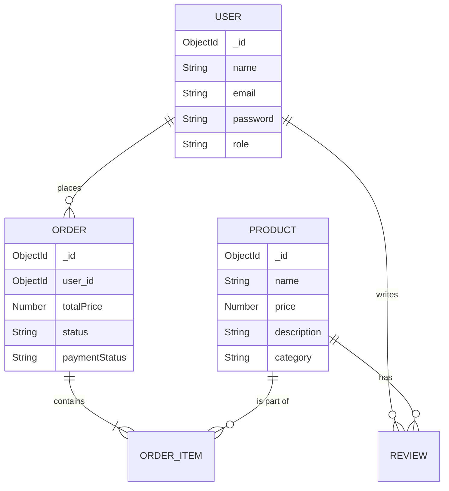
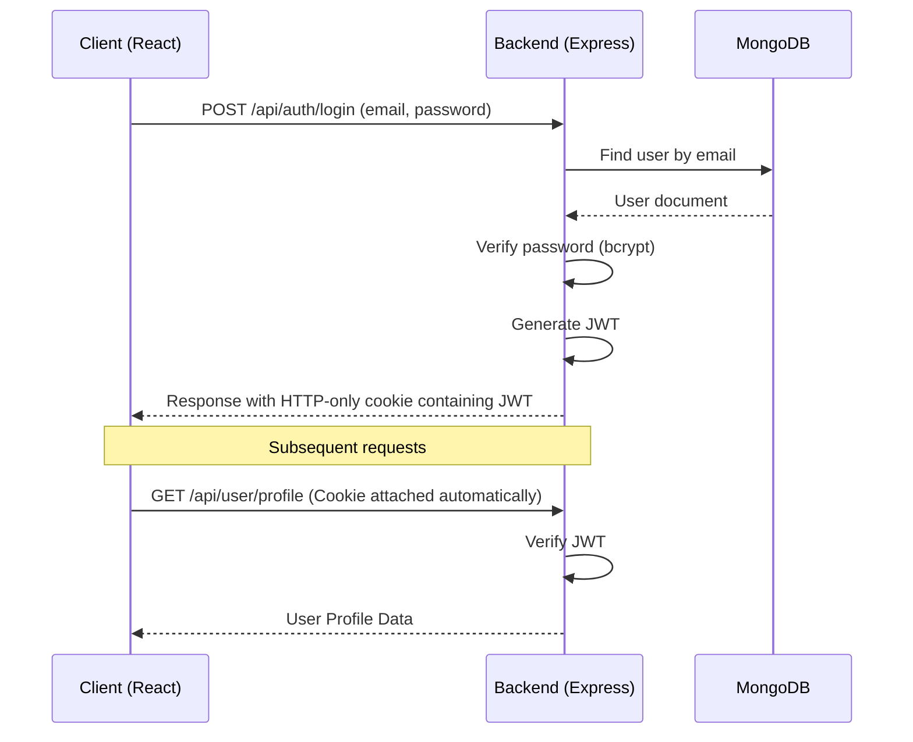
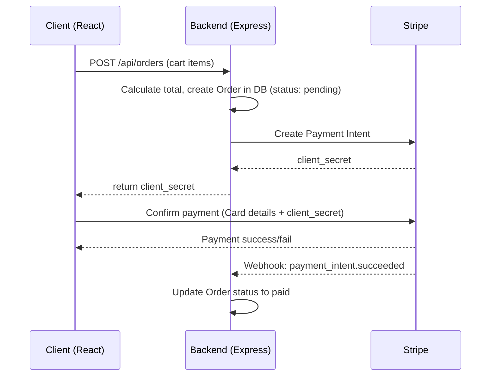

# TechFreak: Current System Architecture

Welcome to the architectural breakdown of **TechFreak**, a full-stack e-commerce platform. This document explains how the current pieces fit together.

## 🏗 Technology Stack

- **Frontend**: React 18, Vite (for fast builds), SWR (for data fetching), React Router v6, Stripe (checkout), Formik/Yup (form validation), Sass (styling).
- **Backend**: Node.js with Express.js, MongoDB via Mongoose, JWT (JSON Web Tokens) in httpOnly cookies, bcryptjs (password hashing), Stripe SDK, Nodemailer, Puppeteer (web scraping), Security middleware (Helmet, XSS protection, Rate limiting). Follows MVC (Model-View-Controller) pattern.
- **ML Service**: Python, FastAPI, Pandas, Scikit-Learn (using TF-IDF + Cosine Similarity). This acts as a stateless recommendation engine.
- **Deployment**: Vercel (both frontend and serverless backend functions).

---

## 🧩 Component Diagram

Here is a high-level view of how the system components interact:

---

## 🔀 Communication Patterns
- **Frontend ↔ Backend**: RESTful HTTP API calls using JSON payloads. SWR is used on the frontend to manage caching, revalidation, and state for these requests.
- **Backend ↔ ML Service**: Synchronous REST HTTP calls over the internal network or public internet, depending on deployment.
- **Authentication**: JWTs are issued by the backend upon login and stored in HTTP-only cookies on the client side to prevent XSS attacks.

---

## 🗄 Database Schema Relationships

---

## 🔐 Authentication Flow

---

## 💳 Payment Flow

---

## 🚀 Deployment Architecture
Currently, TechFreak is deployed on **Vercel**. 
- The React frontend is served statically via Vercel's Edge Network.
- The Express backend is hosted as Serverless Functions on Vercel. 
- *Note*: Hosting Express on Vercel as serverless functions can sometimes lead to cold start issues and limits on execution time, especially for background tasks like Nodemailer and Puppeteer.
